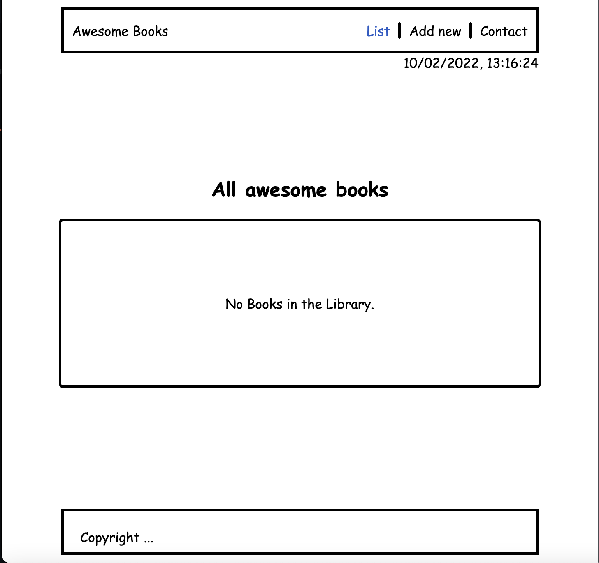

# Awesome Books
> A book collection store




## Built With
- HTML
- CSS
- JS

## Live Demo

[Live Demo Link](https://thermiee.github.io/Awesome-Books-Es6/)

### Prerequisites
The basic requirements for building the executable are:
* A working browser application (Google chrome, Mozilla Fire fox, Microsoft edge ...)


## Getting Started

#### Cloning the project
```
https://github.com/Thermiee/Awesome-Books-Es6
```

### Usage

Open index.html in Chrome

## Author1

👤 **Emmanuel Jolugbo**

- GitHub: [@Thermiee](https://github.com/thermiee)
- LinkedIn: [LinkedIn](https://www.linkedin.com/in/emmanuel-jolugbo/)

## 🤝 Contributing

Contributions, issues, and feature requests are welcome!

Feel free to check the [issues page](../../issues/).

## Show your support

Give a ⭐️ if you like this project!

## Acknowledgments

- Microverse

## 📝 License

This project is [MIT](./MIT.md) licensed.
